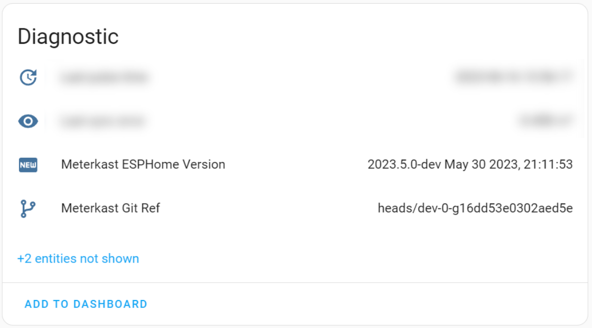

# ESPHome GitRef Sensor component

Custom component for ESPHome that exposes Git version information about the device configuration as a sensor.

> **Note**
> This will only work for configs that are under version control using Git!


This component uses `git describe` to generate a string that will be the published value for the sensor.
When using the `dirty` option, _only_ files that are relevant for the configuration are considered[<sup>[1]</sup>](#dirty-parsing)!  This way the config is only marked as `dirty` when changes in your working copy exist in relevant files, not when changes exist in other configurations! :grinning:

## Usage

Add the following lines to your config.

```yaml
external_components:
  - source: github://RoboMagus/esphome-gitref-sensor

text_sensor:
  - platform: git_ref
    name: "${friendly_name} Git Ref"
    long: true
    all: true
    abbrev: 16
    dirty: "-dirty"
```

Which for a clean config on the `dev` branch of a repo would yield in a sensor value as shown in the HomeAssistant example below:


### Configuration Options

Most options available to this sensor are flags for the [`git describe` command](https://git-scm.com/docs/git-describe).
All of them are **optional**.

- **abbrev** (Int): Instead of using the default number of hexadecimal digits (which will vary according to the number of objects in the repository with a default of 7) of the abbreviated object name, use <n> digits, or as many digits as needed to form a unique object name. An <n> of 0 will suppress long format, only showing the closest tag.
- **all** (Boolean): Instead of using only the annotated tags, use any ref found in refs/ namespace. This option enables matching any known branch, remote-tracking branch, or lightweight tag.
- **broken** (String): Describe the state of the working tree. If a repository is corrupt and Git cannot determine if there is local modification, Git will error out, unless ‘--broken’ is given, which appends the suffix provided by this option instead.
- **commit-ish** (String): Commit-ish object names to describe. Defaults to HEAD if omitted.
- **dirty** (String): Describe the state of the working tree[<sup>[1]</sup>](#dirty-parsing). If the working tree has local modifications the suffix provided by this option is appended to it.
- **long** (Boolean): Always output the long format (the tag, the number of commits and the abbreviated commit name) even when it matches a tag. This is useful when you want to see parts of the commit object name in "describe" output, even when the commit in question happens to be a tagged version. Instead of just emitting the tag name, it will describe such a commit as v1.2-0-gdeadbee (0th commit since tag v1.2 that points at object deadbee…​.).
- **tags** (Boolean): Instead of using only the annotated tags, use any tag found in refs/tags namespace. This option enables matching a lightweight (non-annotated) tag.
- **unversioned** (String, default=`-UNVERSIONED`): Suffix to append when the device config file is not tracked by Git.

### Dirty parsing
When using the `dirty` option, _only_ **tracked** files that are relevant for the configuration are considered!
  
This includes the following:

- The `.yaml` config file itself.
- Nested config files that are `!include`ed.
- Included source files in the `esphome / includes` field.
- Local `external_components`. I.e. external components that exist in the config directory and are not pulled from e.g. github.

If there are uncommitted changes to any of these files, the provided `dirty` suffix will be added to the `git describe` output.

